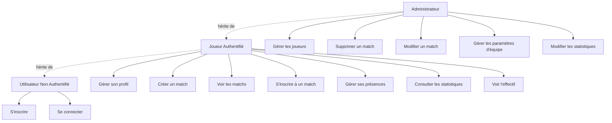
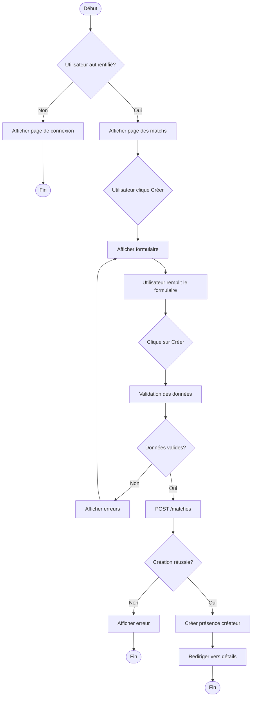
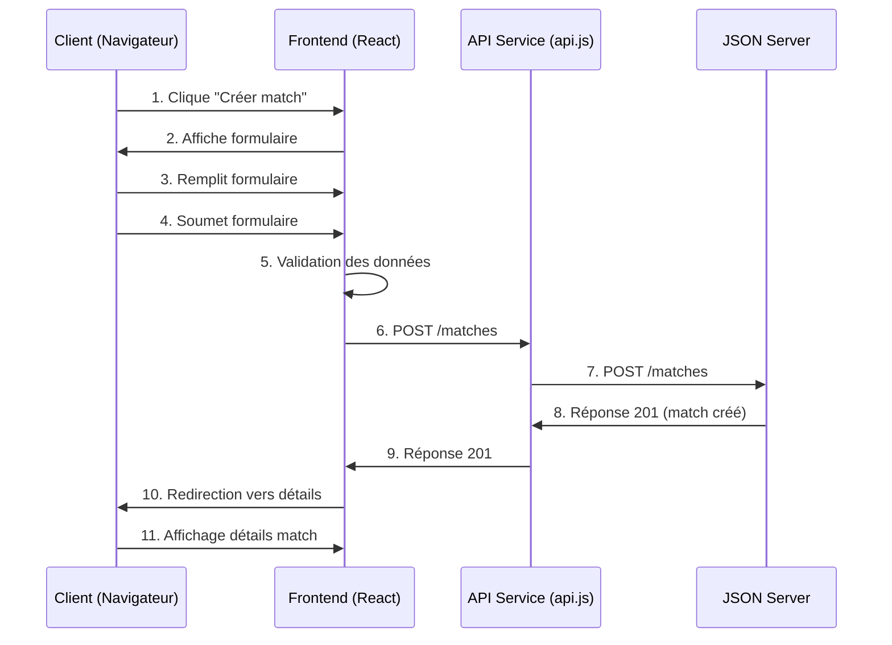
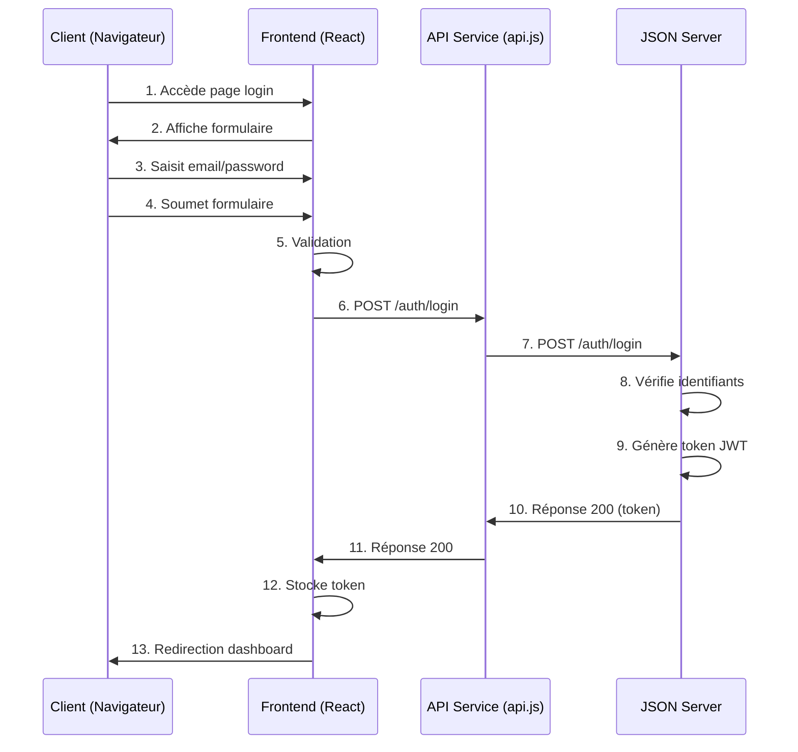

# Diagrammes UML - Team Up

Ce document contient les diagrammes UML nécessaires à la compréhension de l'application Team Up.

---

## 1. Diagramme de Cas d'Usage (Use Cases)

### 1.1 Vue d'ensemble des Cas d'Usage

```
┌─────────────────────────────────────────────────────────────┐
│                    TEAM UP - CAS D'USAGE                    │
└─────────────────────────────────────────────────────────────┘

┌────────────────────┐
│   Utilisateur      │
│   Non Authentifié  │
└─────────┬──────────┘
          │
          ├──> S'inscrire
          ├──> Se connecter
          │
┌─────────▼──────────┐
│   Utilisateur      │
│   Authentifié      │
└─────────┬──────────┘
          │
          ├──> Gérer son profil
          ├──> Créer un match
          ├──> Voir les matchs
          ├──> S'inscrire à un match
          ├──> Gérer ses présences
          ├──> Consulter les statistiques
          ├──> Voir l'effectif
          │
┌─────────▼──────────┐
│   Administrateur   │
└─────────┬──────────┘
          │
          ├──> Gérer les joueurs
          ├──> Supprimer un match
          ├──> Modifier un match
          ├──> Gérer les paramètres d'équipe
          ├──> Modifier les statistiques
```

### 1.2 Diagramme de Cas d'Usage Détaillé

**Acteurs :**

- **Utilisateur Non Authentifié** : Visiteur non connecté
- **Joueur** : Utilisateur authentifié membre d'une équipe
- **Administrateur** : Joueur avec droits administrateur

**Cas d'Usage Principaux :**

1. **Authentification**

   - S'inscrire
   - Se connecter
   - Se déconnecter
   - Réinitialiser le mot de passe (à implémenter)

2. **Gestion de Profil**

   - Consulter son profil
   - Modifier son profil
   - Uploader une photo de profil
   - Changer le thème (clair/sombre)

3. **Gestion des Matchs**

   - Créer un match (Joueur)
   - Voir la liste des matchs
   - Voir les détails d'un match
   - S'inscrire à un match
   - Se désinscrire d'un match
   - Modifier un match (Créateur ou Admin)
   - Supprimer un match (Créateur ou Admin)

4. **Gestion des Présences**

   - Marquer sa présence (Présent/Absent/Pending)
   - Voir les présences d'un match
   - Voir ses statistiques de présence

5. **Gestion d'Effectif**

   - Voir la liste des joueurs
   - Rechercher un joueur
   - Filtrer les joueurs
   - Voir le profil d'un joueur

6. **Statistiques**

   - Consulter ses statistiques personnelles
   - Consulter les statistiques de l'équipe
   - Voir les classements

7. **Messagerie** ⚠️ _En stand-by_

   > **⚠️ STATUT : Fonctionnalité mise en stand-by**
   >
   > La messagerie n'est **pas incluse dans le périmètre fonctionnel principal** du projet et a été mise en stand-by pour se concentrer sur les fonctionnalités core.
   >
   > Cette fonctionnalité pourra être réactivée dans une phase 2 après validation du MVP.

   - Voir la liste des conversations _(en stand-by)_
   - Créer une conversation _(en stand-by)_
   - Envoyer un message _(en stand-by)_
   - Recevoir des messages _(en stand-by)_
   - Marquer les messages comme lus _(en stand-by)_

8. **Paramètres**
   - Modifier les paramètres d'équipe (Admin)
   - Uploader un logo d'équipe (Admin)
   - Changer le thème

### 1.3 Diagramme de Cas d'Usage - Format Mermaid



---

## 2. Diagramme des Flux

### 2.1 Flux : Création d'un Match

```
┌─────────────────────────────────────────────────────────────┐
│              FLUX : CRÉATION D'UN MATCH                     │
└─────────────────────────────────────────────────────────────┘

DÉBUT
  │
  ├─> [Utilisateur authentifié ?]
  │   │
  │   ├─ NON ──> Afficher page de connexion ──> FIN
  │   │
  │   └─ OUI ──>
  │
  ├─> Afficher page des matchs
  │
  ├─> [Utilisateur clique sur "Créer un match"]
  │
  ├─> Afficher formulaire de création
  │
  ├─> [Utilisateur remplit le formulaire]
  │   │
  │   ├─ Date
  │   ├─ Heure
  │   ├─ Lieu
  │   ├─ Type (5v5, 7v7, 11v11)
  │   └─ Nombre max de joueurs
  │
  ├─> [Utilisateur clique sur "Créer"]
  │
  ├─> Validation des données
  │   │
  │   ├─ [Erreur de validation ?]
  │   │   │
  │   │   └─ OUI ──> Afficher erreurs ──> Retour au formulaire
  │   │
  │   └─ NON ──>
  │
  ├─> Envoyer requête POST /matches
  │
  ├─> [Création réussie ?]
  │   │
  │   ├─ NON ──> Afficher message d'erreur ──> FIN
  │   │
  │   └─ OUI ──>
  │
  ├─> Créer présence automatique pour le créateur (status: pending)
  │
  ├─> Rediriger vers la page de détails du match
  │
  └─> FIN
```

### 2.2 Flux : Inscription à un Match

```
┌─────────────────────────────────────────────────────────────┐
│            FLUX : INSCRIPTION À UN MATCH                    │
└─────────────────────────────────────────────────────────────┘

DÉBUT
  │
  ├─> [Utilisateur authentifié ?]
  │   │
  │   └─ NON ──> Afficher page de connexion ──> FIN
  │
  ├─> Afficher détails du match
  │
  ├─> [Match existe ?]
  │   │
  │   └─ NON ──> Afficher erreur 404 ──> FIN
  │
  ├─> [Match est à venir ?]
  │   │
  │   └─ NON ──> Afficher message "Match terminé" ──> FIN
  │
  ├─> [Utilisateur déjà inscrit ?]
  │   │
  │   └─ OUI ──> Afficher "Déjà inscrit" ──> FIN
  │
  ├─> [Nombre de joueurs < maxPlayers ?]
  │   │
  │   └─ NON ──> Afficher "Match complet" ──> FIN
  │
  ├─> [Utilisateur clique sur "S'inscrire"]
  │
  ├─> Créer présence avec status: "pending"
  │
  ├─> Envoyer requête POST /attendances
  │
  ├─> [Inscription réussie ?]
  │   │
  │   ├─ NON ──> Afficher message d'erreur ──> FIN
  │   │
  │   └─ OUI ──>
  │
  ├─> Mettre à jour le compteur players_count
  │
  ├─> Mettre à jour l'affichage (statut: "En attente")
  │
  └─> FIN
```

### 2.3 Flux : Authentification

```
┌─────────────────────────────────────────────────────────────┐
│                  FLUX : AUTHENTIFICATION                    │
└─────────────────────────────────────────────────────────────┘

DÉBUT
  │
  ├─> Afficher page de connexion
  │
  ├─> [Utilisateur saisit email et mot de passe]
  │
  ├─> [Utilisateur clique sur "Se connecter"]
  │
  ├─> Validation des données
  │   │
  │   ├─ [Erreur de validation ?]
  │   │   │
  │   │   └─ OUI ──> Afficher erreurs ──> Retour au formulaire
  │   │
  │   └─ NON ──>
  │
  ├─> Envoyer requête POST /auth/login
  │
  ├─> [Authentification réussie ?]
  │   │
  │   ├─ NON ──> Afficher "Email ou mot de passe incorrect" ──> FIN
  │   │
  │   └─ OUI ──>
  │
  ├─> Recevoir token JWT
  │
  ├─> Stocker le token (localStorage)
  │
  ├─> Charger les données de l'utilisateur
  │
  ├─> Rediriger vers le tableau de bord
  │
  └─> FIN
```

### 2.4 Diagramme de Flux - Format Mermaid

**Flux de création d'un match :**



---

## 3. Diagramme de Séquences

### 3.1 Séquence : Création d'un Match

```
┌──────────────┐    ┌──────────────┐    ┌──────────────┐    ┌──────────────┐
│   Client     │    │   Frontend   │    │  API Service │    │ JSON Server │
│  (Navigateur)│    │   (React)    │    │   (api.js)   │    │  (Backend)  │
└──────┬───────┘    └──────┬───────┘    └──────┬───────┘    └──────┬───────┘
       │                   │                    │                    │
       │ 1. Clique         │                    │                    │
       │ "Créer match"     │                    │                    │
       │──────────────────>│                    │                    │
       │                   │                    │                    │
       │ 2. Affiche        │                    │                    │
       │ formulaire        │                    │                    │
       │<──────────────────│                    │                    │
       │                   │                    │                    │
       │ 3. Remplit        │                    │                    │
       │ formulaire        │                    │                    │
       │──────────────────>│                    │                    │
       │                   │                    │                    │
       │ 4. Soumet         │                    │                    │
       │ formulaire        │                    │                    │
       │──────────────────>│                    │                    │
       │                   │                    │                    │
       │                   │ 5. Validation      │                    │
       │                   │ des données        │                    │
       │                   │<───────────────────┼                    │
       │                   │                    │                    │
       │                   │ 6. POST /matches   │                    │
       │                   │───────────────────>│                    │
       │                   │                    │                    │
       │                   │                    │ 7. POST /matches   │
       │                   │                    │───────────────────>│
       │                   │                    │                    │
       │                   │                    │ 8. Création match  │
       │                   │                    │<───────────────────│
       │                   │                    │                    │
       │                   │ 9. Réponse 201     │                    │
       │                   │<───────────────────│                    │
       │                   │                    │                    │
       │ 10. Redirection   │                    │                    │
       │ vers détails      │                    │                    │
       │<──────────────────│                    │                    │
       │                   │                    │                    │
       │ 11. Affichage     │                    │                    │
       │ détails match     │                    │                    │
       │<──────────────────│                    │                    │
       │                   │                    │                    │
```

### 3.2 Séquence : Inscription à un Match

```
┌──────────────┐    ┌──────────────┐    ┌──────────────┐    ┌──────────────┐
│   Client     │    │   Frontend   │    │  API Service │    │ JSON Server │
│  (Navigateur)│    │   (React)    │    │   (api.js)   │    │  (Backend)  │
└──────┬───────┘    └──────┬───────┘    └──────┬───────┘    └──────┬───────┘
       │                   │                    │                    │
       │ 1. Charge         │                    │                    │
       │ détails match     │                    │                    │
       │──────────────────>│                    │                    │
       │                   │                    │                    │
       │                   │ 2. GET /matches/:id│                    │
       │                   │───────────────────>│                    │
       │                   │                    │                    │
       │                   │                    │ 3. GET /matches/:id│
       │                   │                    │───────────────────>│
       │                   │                    │                    │
       │                   │                    │ 4. Réponse match   │
       │                   │                    │<───────────────────│
       │                   │                    │                    │
       │                   │ 5. Réponse match   │                    │
       │                   │<───────────────────│                    │
       │                   │                    │                    │
       │ 6. Affiche        │                    │                    │
       │ détails match     │                    │                    │
       │<──────────────────│                    │                    │
       │                   │                    │                    │
       │ 7. Clique         │                    │                    │
       │ "S'inscrire"      │                    │                    │
       │──────────────────>│                    │                    │
       │                   │                    │                    │
       │                   │ 8. Vérifie         │                    │
       │                   │ capacité           │                    │
       │                   │<───────────────────┼                    │
       │                   │                    │                    │
       │                   │ 9. POST /attendances│                    │
       │                   │───────────────────>│                    │
       │                   │                    │                    │
       │                   │                    │ 10. POST /attendances│
       │                   │                    │───────────────────>│
       │                   │                    │                    │
       │                   │                    │ 11. Création       │
       │                   │                    │ présence           │
       │                   │                    │<───────────────────│
       │                   │                    │                    │
       │                   │ 12. Réponse 201    │                    │
       │                   │<───────────────────│                    │
       │                   │                    │                    │
       │ 13. Mise à jour   │                    │                    │
       │ interface         │                    │                    │
       │<──────────────────│                    │                    │
       │                   │                    │                    │
```

### 3.3 Séquence : Authentification

```
┌──────────────┐    ┌──────────────┐    ┌──────────────┐    ┌──────────────┐
│   Client     │    │   Frontend   │    │  API Service │    │ JSON Server │
│  (Navigateur)│    │   (React)    │    │   (api.js)   │    │  (Backend)  │
└──────┬───────┘    └──────┬───────┘    └──────┬───────┘    └──────┬───────┘
       │                   │                    │                    │
       │ 1. Accède         │                    │                    │
       │ page login        │                    │                    │
       │──────────────────>│                    │                    │
       │                   │                    │                    │
       │ 2. Affiche        │                    │                    │
       │ formulaire        │                    │                    │
       │<──────────────────│                    │                    │
       │                   │                    │                    │
       │ 3. Saisit         │                    │                    │
       │ email/password    │                    │                    │
       │──────────────────>│                    │                    │
       │                   │                    │                    │
       │ 4. Soumet         │                    │                    │
       │ formulaire        │                    │                    │
       │──────────────────>│                    │                    │
       │                   │                    │                    │
       │                   │ 5. Validation      │                    │
       │                   │<───────────────────┼                    │
       │                   │                    │                    │
       │                   │ 6. POST /auth/login│                    │
       │                   │───────────────────>│                    │
       │                   │                    │                    │
       │                   │                    │ 7. POST /auth/login│
       │                   │                    │───────────────────>│
       │                   │                    │                    │
       │                   │                    │ 8. Vérifie         │
       │                   │                    │ identifiants       │
       │                   │                    │<───────────────────│
       │                   │                    │                    │
       │                   │                    │ 9. Génère token    │
       │                   │                    │ JWT                │
       │                   │                    │<───────────────────│
       │                   │                    │                    │
       │                   │ 10. Réponse 200    │                    │
       │                   │ avec token         │                    │
       │                   │<───────────────────│                    │
       │                   │                    │                    │
       │                   │ 11. Stocke token   │                    │
       │                   │ (localStorage)     │                    │
       │                   │<───────────────────┼                    │
       │                   │                    │                    │
       │ 12. Redirection   │                    │                    │
       │ vers dashboard    │                    │                    │
       │<──────────────────│                    │                    │
       │                   │                    │                    │
```

### 3.4 Diagramme de Séquences - Format Mermaid

**Séquence : Création d'un match**



**Séquence : Authentification**



---

## 4. Résumé des Diagrammes

| Diagramme       | Description                            | Fichier   |
| --------------- | -------------------------------------- | --------- |
| **Cas d'Usage** | Acteurs et fonctionnalités principales | Section 1 |
| **Flux**        | Processus métier détaillés             | Section 2 |
| **Séquences**   | Interactions entre composants          | Section 3 |

---

## 5. Notes

- Les diagrammes Mermaid peuvent être rendus directement dans Markdown sur GitHub
- Pour une meilleure visualisation, utilisez un outil UML comme Draw.io, PlantUML, ou Lucidchart
- Les diagrammes peuvent être exportés en PNG, SVG ou PDF pour inclusion dans la documentation
